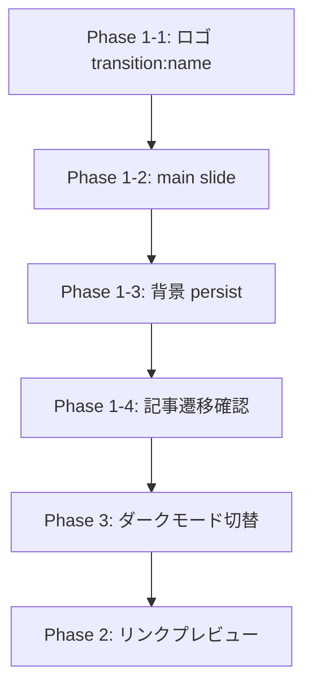

# 実装計画: View Transitions 強化 / リンクプレビュー / ダークモード切替アニメーション

> **目的**: 3つのUX改善タスクの実装ガイド。別のエージェントが着手する前提で、必要なコンテキスト・設計方針・具体的な変更箇所をすべて記載する。

---

## 現状のコンテキスト

### View Transitions
- **Astro バージョン**: `^5.16.11`（Astro 5 系）
- **`<ClientRouter />`** が `src/layouts/BaseLayout.astro:54` で有効化済み → Astro の View Transitions は **すでにオン**
- **既存の `transition:name`**:
  - `src/pages/posts/[slug].astro:64` — 記事タイトル (`post-title-{slug}`)
  - `src/pages/posts/[slug].astro:66` — 記事日付 (`post-date-{slug}`)
  - `src/components/PostSearch.tsx:203,206` — 一覧側の対応要素に `viewTransitionName` を CSS として設定済み
- **`transition:animate` は未使用** — デフォルトの `fade` が全ページに適用されている状態

### テーマ切替の仕組み
- `BaseLayout.astro:57-63` の `is:inline` スクリプトで、レンダリング前に `data-theme` 属性を設定（フラッシュ防止）
- `BaseLayout.astro:114-124` の `setupThemeToggle()` で `click` イベントを処理
- `BaseLayout.astro:134-136` の `astro:after-swap` イベントでページ遷移時にテーマを再適用
- テーマ切替は `document.documentElement.setAttribute('data-theme', next)` で即座に反映
- CSS 側は `body` に `transition: background-color var(--transition-normal), color var(--transition-normal)` が設定済み (`global.css:139-141`)

### コンポーネント構成
- ヘッダーロゴ: `BaseLayout.astro:87` — `<a href="/" class="logo">RK / PORTFOLIO</a>`
- ナビゲーション: `BaseLayout.astro:88-93`
- 記事一覧: `PostSearch.tsx`（React コンポーネント、`client:load`）

---

## Phase 1: View Transitions の本格活用

### 1-1. ヘッダーロゴの共有要素トランジション

**目的**: ページ遷移時にロゴが「その場に留まる」自然な印象を与える

**変更箇所**: `src/layouts/BaseLayout.astro`

```astro
<!-- L87: ロゴに transition:name を追加 -->
<a href="/" class="logo" transition:name="site-logo">RK / PORTFOLIO</a>
```

> [!NOTE]
> ロゴは全ページで同じ要素なので、`transition:name` を付けるだけで Astro が自動的に共有要素として扱い、ページ遷移時にクロスフェードではなく「位置を保持」するアニメーションになる。

### 1-2. ページごとのトランジションアニメーション指定

**目的**: ページ遷移時のデフォルト `fade` に加え、メインコンテンツに `slide` を適用して奥行き感を出す

**変更箇所**: `src/layouts/BaseLayout.astro`

```astro
---
import { ClientRouter, fade, slide } from 'astro:transitions';
---

<!-- L101-103: main に transition:animate を追加 -->
<main class="main" transition:animate={slide({ duration: '0.2s' })}>
  <div class="container">
    <slot />
  </div>
</main>
```

> [!WARNING]
> `slide` を適用すると、Three.js の Canvas（AsciiBackground）がページ遷移のたびに再マウントされる可能性がある。`transition:persist` を `<AsciiBackground>` の親 div や `<AmbientGlow>`, `<CRTOverlay>` に検討すること。

### 1-3. 背景要素の永続化（transition:persist）

**目的**: ページ遷移時に 3D 背景や CRT オーバーレイが再レンダリングされるのを防ぐ

**変更箇所**: `src/layouts/BaseLayout.astro`

```astro
<!-- L78: AmbientGlow を persist -->
<div transition:persist="ambient-glow">
  <AmbientGlow client:only="react" />
</div>

<!-- L81: CRTOverlay を persist -->
<div transition:persist="crt-overlay">
  <CRTOverlay client:only="react" />
</div>
```

> [!IMPORTANT]
> `<AsciiBackground>` は `src/pages/index.astro` にのみ存在するため、`transition:persist` は不要。`BaseLayout` 内の共通エフェクトのみ対象とすること。ただし、`index.astro` で ASCII Background が配置されている div にも注意が必要。ページを離れると消えて戻ると再レンダリングされる。これは許容する。

### 1-4. 記事一覧 → 記事詳細のトランジション改善

**現状**: `PostSearch.tsx` (React) 内で `viewTransitionName` を inline style で設定済み。`[slug].astro` 側にも `transition:name` が設定済み。基本的な共有要素トランジションは動作するはず。

**確認事項**:
- ページネーションで表示されていない記事への遷移時に `viewTransitionName` の衝突が起きていないか確認する
- 日本語 slug のエンコーディングが一致しているか確認する（両側で `encodeURIComponent(slug).replace(/%/g, '')` を使用中）

**追加改善（任意）**:
- 記事カード全体に `transition:name` を付けて、カードが記事ページに展開するようなアニメーションを追加してもよい

---

## Phase 2: テキストリンクホバー時のリンクプレビュー

### 2-1. 設計方針

記事本文中の **内部リンク**（`/posts/xxx` へのリンク）にマウスホバーすると、対象記事のタイトルやサムネイル（あれば）がツールチップ風にフェード表示される機能。

**実装方式**: Vanilla JS（`<script>` タグ内）でのDOM操作。React コンポーネントにはしない（記事本文は Astro が生成する静的 HTML のため）。

### 2-2. 実装の詳細

**推奨**: `src/pages/posts/[slug].astro` の既存 `<script>` ブロック内に `setupLinkPreviews()` 関数を追加する（`setupImageFigures()` や `setupSidenotes()` と同じパターン）。

```typescript
function setupLinkPreviews() {
  // 1. .prose 内の内部リンク（/posts/ で始まる href）を取得
  const links = document.querySelectorAll('.prose a[href^="/posts/"]');

  // 2. プレビュー用のフローティング要素を1つだけ作成
  const preview = document.createElement('div');
  preview.className = 'link-preview';
  preview.style.display = 'none';
  document.body.appendChild(preview);

  // 3. 各リンクに mouseenter / mouseleave を設定
  links.forEach((link) => {
    link.addEventListener('mouseenter', async (e) => {
      const href = link.getAttribute('href');
      // postMap から slug でデータを取得してプレビュー表示
    });
    link.addEventListener('mouseleave', () => {
      preview.style.display = 'none';
    });
  });
}
```

### 2-3. プレビューデータの取得方法

**方式A（推奨）: ビルド時に記事メタデータを埋め込む**
- `[slug].astro` のフロントマターで `allPostsMeta` をすでに取得している（L46-52）
- これを `<script define:vars={{ allPostsMeta }}>` で クライアントに渡す
- ホバー時に slug をキーにしてメタデータを参照する（fetch 不要、高速）

```astro
<script define:vars={{ allPostsMeta }}>
  // allPostsMeta は [{slug, title, tags, date}, ...] の配列
  const postMap = new Map(allPostsMeta.map(p => [p.slug, p]));

  function setupLinkPreviews() {
    const links = document.querySelectorAll('.prose a[href^="/posts/"]');
    // ... postMap.get(slug) でデータを取得
  }
</script>
```

> [!WARNING]
> `define:vars` を使うスクリプトは自動的に `is:inline` 扱いになるため、既存の `<script>`（モジュールスクリプト）とは分けて別の `<script define:vars={...}>` ブロックを作成すること。既存の `setupImageFigures()` / `setupSidenotes()` を含む `<script>` ブロックに混ぜると動作が変わる。

### 2-4. プレビューのスタイル

**変更箇所**: `src/pages/posts/[slug].astro` の `<style>` ブロックに追加

```css
:global(.link-preview) {
  position: fixed;
  z-index: 1000;
  padding: 12px 16px;
  max-width: 320px;
  background-color: var(--color-bg-card);
  border: 1px solid var(--color-border);
  box-shadow: var(--shadow-md);
  pointer-events: none;
  opacity: 0;
  transition: opacity 150ms ease;
}

:global(.link-preview.visible) {
  opacity: 1;
}

:global(.link-preview__title) {
  font-size: 0.9rem;
  font-weight: 600;
  color: var(--color-text);
  margin-bottom: 4px;
}

:global(.link-preview__date) {
  font-size: 0.7rem;
  font-family: var(--font-mono);
  color: var(--color-text-muted);
}
```

> [!TIP]
> `pointer-events: none` をプレビュー要素に設定することで、ユーザーがプレビューの上にカーソルを移動しても `mouseleave` が正しく発火する。JSで動的に追加するので `:global()` ラッパーが必要。

### 2-5. モバイル対応

- タッチデバイスではホバーが存在しないため、`matchMedia('(hover: hover)')` でホバー可能な環境でのみ初期化する
- モバイルではリンクプレビューを無効にする

---

## Phase 3: ダークモード切替アニメーション（View Transition API）

### 3-1. 設計方針

テーマ切替時に、ブラウザの **View Transition API** (`document.startViewTransition()`) を使って、円形のクリップパスで新しいテーマが広がるアニメーションを実装する。

> [!IMPORTANT]
> ここで言う View Transition API は、**Astro のページ間 View Transitions（`<ClientRouter />`）とは別物**。ブラウザネイティブの `document.startViewTransition()` を使用した **同一ページ内の DOM 更新アニメーション** である。

### 3-2. 実装箇所

**変更箇所**: `src/layouts/BaseLayout.astro` の `setupThemeToggle()` 関数

```typescript
function setupThemeToggle() {
  const toggle = document.getElementById('theme-toggle');
  toggle?.addEventListener('click', (e) => {
    const current = document.documentElement.getAttribute('data-theme');
    const next = current === 'dark' ? 'light' : 'dark';

    // View Transition API 非対応ブラウザではフォールバック
    if (!document.startViewTransition) {
      document.documentElement.setAttribute('data-theme', next);
      localStorage.setItem('theme', next);
      return;
    }

    // クリック位置を起点に円形展開アニメーション
    const x = e.clientX;
    const y = e.clientY;
    // 画面の四隅までの最大距離を半径にする
    const endRadius = Math.hypot(
      Math.max(x, window.innerWidth - x),
      Math.max(y, window.innerHeight - y)
    );

    const transition = document.startViewTransition(() => {
      document.documentElement.setAttribute('data-theme', next);
      localStorage.setItem('theme', next);
    });

    transition.ready.then(() => {
      document.documentElement.animate(
        {
          clipPath: [
            `circle(0px at ${x}px ${y}px)`,
            `circle(${endRadius}px at ${x}px ${y}px)`,
          ],
        },
        {
          duration: 500,
          easing: 'ease-in-out',
          pseudoElement: '::view-transition-new(root)',
        }
      );
    });
  });
}
```

### 3-3. 必要な CSS

**変更箇所**: `src/styles/global.css` に追加

```css
/* ===== Theme Toggle View Transition ===== */
::view-transition-old(root),
::view-transition-new(root) {
  animation: none;
  mix-blend-mode: normal;
}

::view-transition-old(root) {
  z-index: 1;
}

::view-transition-new(root) {
  z-index: 9999;
}
```

> [!WARNING]
> `body` に設定されている `transition: background-color var(--transition-normal), color var(--transition-normal)` (`global.css:139-141`) は **View Transition API のアニメーションと競合する可能性がある**。View Transition が動作中は CSS transition を無効化するか、テスト時に確認すること。

### 3-4. ブラウザ対応

- `document.startViewTransition` は Chrome 111+, Edge 111+, Safari 18+ で対応
- Firefox は未対応（2026年5月時点で要確認）
- 非対応ブラウザでは従来通り即座にテーマが切り替わるフォールバックを実装済み

---

## 実装順序と依存関係



**推奨順**: Phase 1 → Phase 3 → Phase 2
- Phase 1 と 3 は変更範囲が小さく確認しやすい
- Phase 2 はスクリプト量が最も多い

---

## 注意事項・制約

1. **gemini.md のルール遵守**: コメントとエージェントの発言は日本語で行うこと
2. **ビルド確認**: 各 Phase 完了時に `pnpm run build` でエラーがないことを確認する
3. **git commit**: 各 Phase 完了時にコミットすること
4. **React コンポーネントとの共存**: `PostSearch.tsx` は `client:load` で hydrate されるため、View Transition の `viewTransitionName` は React 側の inline style で設定する必要がある（Astro の `transition:name` ディレクティブは `.astro` ファイルでのみ使用可能）
5. **CJK slug のエンコーディング**: `encodeURIComponent(slug).replace(/%/g, '')` のパターンが一致しないと View Transition が壊れるので、両側で同じ変換を使うこと
6. **`define:vars` スクリプトの分離**: `define:vars` を使う `<script>` は `is:inline` 扱いになるため、既存のモジュールスクリプトと混ぜないこと
