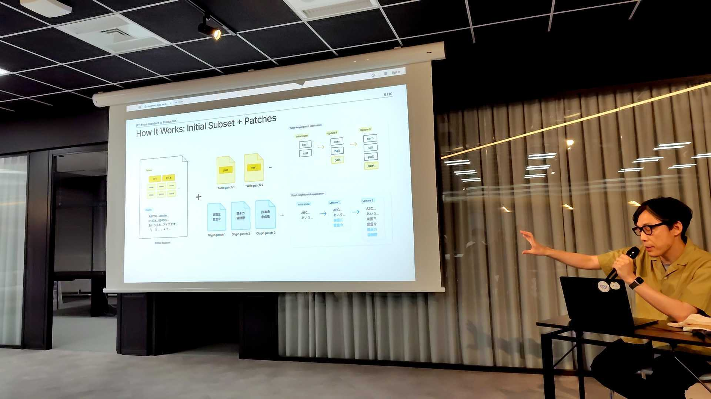

個人的な趣味として、デザインに直接関係なさそうな勉強会にも参加するようにしています。今回はその一環で参加した、Webフォントについての勉強会で聞いた内容をまとめました。

イベントから結構間が空いてしまった…。

# イベント概要

connpassの説明を引用して紹介します。

> 欧文では軽やかに自作フォントが使われる一方 CJK という鉄下駄を履いた我々には、様々な制約が乗っかる。
> 独自のフォントに統一したいデザイナ パフォーマンスを懸念するエンジニア
> サブセットをチューニングしても初期ロードは重く ページごとのサブセットではキャッシュが使い回せない
> 我々は、この壁を超えられるのだろうか？ 一縷の望みである Incremental Font Transfer は、この問題を解決するんだろうか？
> みんなで困りごとの共有と、現状と未来について語り合う会。

発表者と内容は以下の通り。

- [terkel - connpass](https://connpass.com/user/terkel/): Incremental Font Transfer — 仕様策定と実装の現場から
- [kotarok - connpass](https://connpass.com/user/kotarok/): Webフォント時代の和欧混植と書体選び（仮題）

導入は主催のjxckさんから。個人ブログでのWebフォントまわりの取り組み（WOFF2最適化、Puppeteerでのサブセッティング、CLS改善など）を時系列で紹介しつつ、「最近もうちょっとなんとかなりそう。みんなでなんとかしていこう」という趣旨で会が始まった。

- [blog.jxck.io](https://blog.jxck.io/)
- [WebFont の WOFF2 対応によるサイズ最適化](https://blog.jxck.io/entries/2018-02-13/web-font-woff2.html)
- [Puppeteer で静的サイトの Font Subsetting](https://blog.jxck.io/entries/2020-09-07/font-subsetting-with-puppeteer.html)
- [Web Font のメトリクス上書きによる CLS の改善](https://blog.jxck.io/entries/2021-02-25/font-metrics-override.html)

---

## @terkel: Incremental Font Transfer — 仕様策定と実装の現場から

### 300文字概要

CJKフォントは収録グリフが9,000〜23,000字規模でファイルサイズも数MB〜10MB前後と桁外れに大きい。これまでの配信方法は「JSによる動的サブセット」と「CSS unicode-range＋静的サブセット」の2系統で、どちらも一長一短だった。IFT（Incremental Font Transfer）はこの2つのいいとこ取りを狙うW3C仕様で、最低限のinitial subsetに必要なグリフをパッチとして段階的に足していく方式。配信されるフォントは終始1つなので、シェイピング（カーニング・合字・約物詰め）が全文字間で壊れない。現在はCandidate Recommendation Draft段階で、Chromeが2026年中のネイティブ実装を目指している。Studioでは先行してRust + WebAssemblyのpolyfillで本番運用しており、標準仕様へのフィードバックとして取り組んでいる。

### 感想

問題の構造がきれいに整理されていて聞きやすかった。「どのグリフを、いつ、どう配信するか」に集約される、という一言が良い。

自分はデザイナーとして「このフォント使いたい」側の人間なので、エンジニアとの綱引きの話は他人事ではない。Webフォントを使いたいけどパフォーマンスが…という話になると、結局「じゃあシステムフォントで」となって終わるケースは何度か経験がある。IFTが実用化されれば、この会話のトーンが変わりそうだなと思った。今後が楽しみだ。

特に印象に残ったのは、デフォルトで適用されるOpenType機能のうち、横組みのプロポーショナルメトリクス（palt）が抜けていた話。縦組み側（vpal）は入っていたのに横が漏れていた原因が、ブラウザのシェイピングエンジン（HarfBuzz）のデフォルト設定に遡るという。CJK圏外のメンテナには横組み詰めの重要性が伝わりにくいからこそ、CJKからのフィードバックが必要、という呼びかけには納得した。

縦書きWebの勉強会でも似た話があった。アジア以外の開発者に書字方向の概念を理解してもらうハードルの話。Web標準の世界では「CJK圏の人間が声を上げないと、CJK圏の課題は放置される」という構造が繰り返し出てくる。

### 追加で知りたかったこと：既存の2方式の違い

発表で整理されていた2つの配信方式について、もう少し噛み砕いて理解しておくために少し調べた。

1つ目はJavaScriptによる動的サブセット。ページ上で実際に使われている文字をJSが検出して、必要な分だけサーバーから取ってくる方式。Adobe FontsやTypeSquareなどが採用している。柔軟だが、JS依存でキャッシュが効きにくく、取得が間に合わないとフォントが歯抜けで表示されることがある。

2つ目はCSS unicode-range＋静的サブセット。フォントをあらかじめ多数のサブセットに分割しておき、`@font-face`の`unicode-range`でブラウザに「このファイルはどの文字をカバーするか」を伝える方式。Google Fontsがこれ。ブラウザネイティブでJS不要、キャッシュも効く。ただしブラウザは分割されたサブセットを別々のフォントとして扱うため、サブセットの境界をまたぐカーニングや合字が壊れる。23,000文字分のマッピングをCSSに書く必要もあり、CSSが肥大化する。

IFTは「1つのフォントを差分で育てる」方式なので、テーブルの重複もなく、シェイピングも保たれる。両方のいいとこ取り、というのはこういうこと。

### 追加で知りたかったこと：IFTの仕組みをもう少し

当日スライドでも説明があったが、IFTの流れを自分なりに整理する。

1. 最低限のグリフを含むinitial subsetを用意する
2. 追加分を小さなパッチとして用意する（異体字なども個別にできる）
3. フォント内部にパッチの対応表（IFT / IFTXテーブル）を埋め込んでおく
4. ブラウザは必要な文字を含むパッチだけを取得して、手元のフォントを拡張する

ページ遷移時は、新しいページで必要になったパッチだけ足せばいい。閲覧を続けるほど、そのユーザーにとって必要なフォントが手元に揃っていく。

仕様は[W3C Candidate Recommendation Draft](https://www.w3.org/TR/IFT/)として公開されている。リファレンス実装は[w3c/ift-encoder](https://github.com/w3c/ift-encoder)。適合性テストは[wpt.fyi/results/IFT](https://wpt.fyi/results/IFT)で追える。

---

## @kotarok: Webフォント時代の和欧混植と書体選び

### 300文字概要

Noto Sans JPの制作にGoogle側のディレクションとして関わった本人による、書体選びと和欧混植の話。macOSはヒラギノ、Windowsは游ゴシック、そしてNoto Sans JPがWindows標準搭載された今、和文はシステムフォントで成立する場面が増えた。残るのは欧文をどう揃えるかで、和欧混植の原則として「筆記具の一貫性」が提示された。ウェイトのマッチング、ストロークの終端処理、角の処理を揃えることで「別の筆記具で書いたような違和感」を避ける。書体はヒューマニスト系（Frutiger / Noto Sans / Open Sans）、モダンUI系（Inter / SF / Roboto / Aptos）、ジオメトリック系（Futura / Poppins）と系統立てて整理された。Noto Sans JPの設計経緯やGoogle Sansの逸話など、当事者ならではのエピソードが聞けた発表だった。

### 感想

冒頭の「今更俺がウェブフォントについて語ることなどあるだろうか…」から始まって、蓋を開けたらNoto Sans JPの制作当事者の話が出てくるので面白い。

Noto Sans JPの初稿がりょうゴシック調でイキイキしていたという話、設計者の西塚涼子氏が同じ人なので納得。そこからディレクションを加えていって、「10年かけて流行っていくもの」と西塚氏が言っていたのが、2014年リリースから約11年で2025年にWindows標準搭載。答え合わせだ〜という話。

実務に一番効きそうだったのは和欧混植の原則の話。筆記具の一貫性という軸で見るとよい、と語られていた。確かに判断基準が明確になって良かった。ウェイトのコントラスト、起筆・終筆の処理、角のスクエア／ラウンドの一致。言われてみればそうだよなという内容だが、体系立てて聞いたのは初めてだった。

同じ`font-size`でも和文と欧文で体感サイズが違う理由の説明も良かった。欧文は小文字の高さ（x-height）が体感サイズを左右する一方、CJKは仮想ボディ（正方形の枠）がほぼ枠いっぱいに字面が来るので、並べると和文が大きく見える。x-heightの高い欧文を選ぶと体感差が縮まる。自分のサイトのフォント選びにも活かせそう。

以前読んだ[Webフォント実践ガイド Google Fontsではじめる 美しく機能的なタイポグラフィ](https://amzn.asia/d/0fg3pcw2)という書籍でこの辺りかなり分かりやすく紹介されていたので、リンクを貼っておく。

### 追加で知りたかったこと：従属欧文と和欧混植

発表の中で「昔の和文書体の従属欧文は歪だった」という話があった。従属欧文とは、日本語フォントに最初から含まれている半角英数字用のラテングリフのこと。昔は全角の都合に合わせて変形されていたので、欧文として見ると不自然だった。だから和文と欧文を別フォントで組む和欧混植が必要だった。

最近の日本語フォントは従属欧文も綺麗になっているので、混植なしで使える場面も増えているそう。ただしブランドの雰囲気を出したいときは、あえて特定の欧文を混植することもあるんだとか。

---

## Q&A

当日のQAが興味深かったのでこれも残しておく。

### Q. 最初のsubsetはサイト全体で1つ？ページごとに個別？

A. サイト全体で1つが基本。Studioの場合はコンテンツが事前に分かっているので、必要なグリフをinitial subsetに入れ込んでしまえる。フォーム入力など予測できない文字で不足する分だけパッチを取りに行く形。

「最初のページを表示している間に、そのサイトで使う分を裏で全部組み上げてしまうのが理想」という言葉が印象的だった。

### Q. パッチに分割して送っているだけに見える。転送量の優位性は？

A. unicode-range方式だと数十のサブセットをダウンロードすることになるが、各サブセットが共通テーブルを重複して持っている。IFTではその重複が不要になる。加えてCSSも小さくなる。

### Q. UIに使うフォントと本文に使うフォントは分けている？

A. 本文はヒューマニスト系が読みやすい。UIにはInterやSan Franciscoのような書体、矩形や円で構成されたジオメトリックな書体が形の明快さで合うことも多い。用途によって選ぶ。

### Q. サブセットでリッチな機能を削ぎ落としてしまうのでは？

A. IFTなら、異体字や別ウェイトをパッチとして持てるので、増やしてもペイロード増は局所的で済む。リッチな機能を保ったまま軽量配信が可能になる方向。

### Q. i18n対応サービスで和文と欧文のサイズ感が合わない問題

A. 海外ブランドの日本展開でも起きる。特徴のある欧文を使っていたのに日本語ではヒラギノが当たる、文字サイズの認識が言語間で違うのに同じ指定で使ってしまう、など。違和感を減らす方向ならNoto系がおすすめ。IKEAがNoto採用前にメイリオを使っていた話も出た。

CSSの`font-size-adjust`が対処手段になりそうだと思ったので調べた。フォントごとに異なるx-heightなどの基準を揃えて、見かけの文字サイズを近づけるプロパティ。CJK向けに全角字面を基準にする`ic-width`という値も議論が進んでいるらしい。実務に入れるにはブラウザ対応の確認が必要だが、引き出しとして覚えておく。

- [font-size-adjust - MDN Web Docs](https://developer.mozilla.org/ja/docs/Web/CSS/font-size-adjust)

---

## 話題に出たサイト・ツール リスト

### 仕様・標準

- [Incremental Font Transfer（W3C CR Draft）](https://www.w3.org/TR/IFT/)
- [w3c/ift-encoder（リファレンス実装）](https://github.com/w3c/ift-encoder)
- [wpt.fyi/results/IFT（適合性テスト）](https://wpt.fyi/results/IFT)

### jxck氏のWebフォント関連エントリ

- [WebFont の WOFF2 対応によるサイズ最適化](https://blog.jxck.io/entries/2018-02-13/web-font-woff2.html)
- [Noto Sans Hinted と font-feature-settings: 'palt'](https://blog.jxck.io/entries/2019-10-13/font-feature-settings.html)
- [Puppeteer で静的サイトの Font Subsetting](https://blog.jxck.io/entries/2020-09-07/font-subsetting-with-puppeteer.html)
- [Web Font のメトリクス上書きによる CLS の改善](https://blog.jxck.io/entries/2021-02-25/font-metrics-override.html)
- [Compression Dictionary Transport によるコンテンツ圧縮の最適化](https://blog.jxck.io/entries/2026-04-21/compression-dictionary-transport.html)

### 書体・フォント関連

- [Aptos — Microsoft 365の新標準フォント](https://learn.microsoft.com/en-us/typography/font-list/aptos)
- [りょうゴシック — Adobe Fonts](https://fonts.adobe.com/fonts/ryo-gothic-plusn)

## おわりに

Webフォントの話、デザイナーとしては「使いたいフォントが使えるかどうか」にしか関心が向きがちだったけど、配信の仕組みまで理解しておくとエンジニアとの会話の質が変わると思った。IFTがブラウザネイティブで動く日が来れば、「重いからシステムフォントで」という議論が過去のものになるかもしれない。

和欧混植の話は明日から使える。筆記具の一貫性という軸を手に入れたので、次にフォントを選ぶときの判断が少し楽になりそう。

ブログを書いている過程で、このブログそういえば和欧混植が適当になっていたことに気がついた。やらねば…

この記事が誰かの参考になれば幸いです。終わり。
