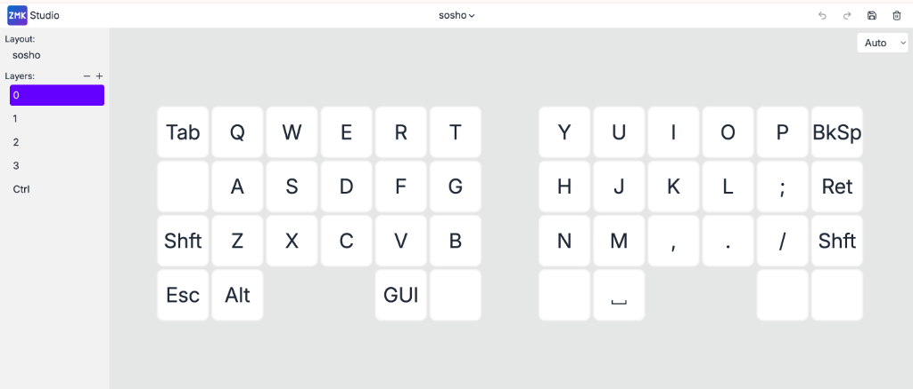
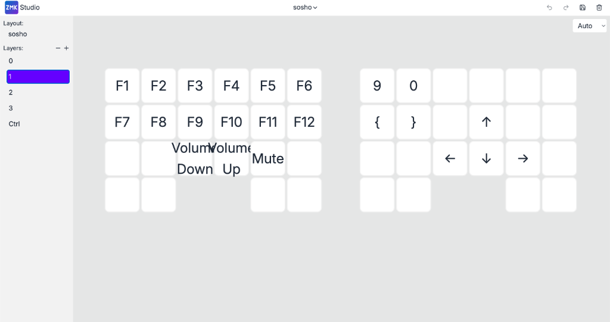
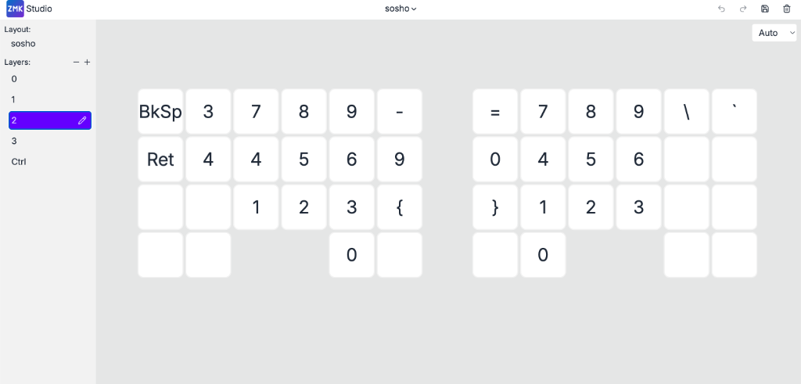
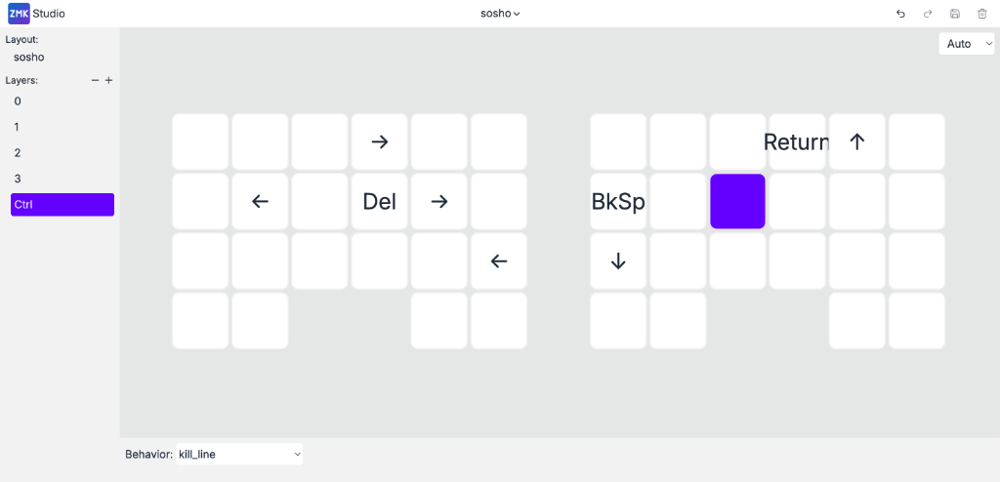

<!--
【画像保管・執筆ガイド】
1. 画像の保存場所:
   - この記事専用の画像フォルダ: ./20260922_so-sho/
   - 画像ファイルをこのフォルダに配置してください。

2. Markdownでの画像記法（CustomImageコンポーネント連動）:
   
   - "タイトル" を記述すると、自動的に「図N: タイトル」という連番キャプションが付与されます。
   - "タイトル" を省略した場合は、[ALT] テキストがキャプションとして表示されます。
   - 縦長画像は max-height: 60vh で自動調整されます。

3. 記事の公開:
   - 執筆中は `draft: true` のままにしておきます。
   - 完成して本番公開する際に `draft: false` に変更（または削除）してください。
-->

## はじめに

これまでのブログとはかなり毛色が違うが、最近「双掌（SO-SHO）」という名前の自作キーボードを購入・作成した。

[エレキット 双掌(SO-SHO) - 遊舎工房](https://shop.yushakobo.jp/products/12667?srsltid=AU7gw4Xd8TVTpZHuhjRP4hfFl_ciiCmn3yqVs21zMgiYJni2z_faZzKG)

このブログでは、私が使っているキーマップを共有しつつ、普段のデザイン業務で使ってみてどうだったかをまとめておく。

目的としてはこんな感じ。
- デザイナーで分割キーボードってどうなの？と思っている人がいると思うので、私なりの考えをまとめておく。
- 遊舎工房で買うことを検討している人の、購入→使えるようになるまでの不安感をなくす。
- 私が困っていたところでつまづく人をいなくする。
- 作ったキーボードを自慢しつつ、困りごとを愚痴る。

---

## デザイナーで分割キーボードってどうなの？（私なりの考え）

結論から先にいうが、個人的には分割キーボードはデザイナーにとってもいい選択肢だと思う。慣れるまでのめんどくささと費用を許容できるなら、よくあるキーボードよりは良い体験を得られると思う。

分割キーボードについての議論をちょこちょこ見かけるが、しれっと前提とか、どこからくる良さなのかがごちゃまぜになっていたりする。今回は「自作キーボードの1種として作る分割キーボードの中の、双掌という商品」というふうに整理して、自作キーボードの良さと、分割キーボードの良さと、双掌自体の良さが分けて書いてみた。

### 分割キーボードとしての良さ：体の真正面にスケッチブックを置ける

一番良かったのはこれ。
左右のキーボードの間がぽっかり空くので、**体の真正面にスケッチブックやノート、リアルの紙資料を置けるようになる**。

アイデア出しやワイヤーフレームのスケッチ、資料をチェックしながらのPC作業がめちゃくちゃ捗る。
普通の一体型キーボードだとノートを左右のどちらかに追いやるしかなくて身体がねじれるので、これだけでも分割にしてよかったと思えるレベル。

### 自作キーボードとしての良さ：左手への機能集約と、JIS/USのいいとこ取り

自作キーボードは大抵の場合、キーマップの書き換えが可能だ。それによりいろんな恩恵を受けることができる。

デザイナーは右手でマウスやペンを持っている時間が長いので、ショートカットを左手だけで操作できるように色々設定できるのが便利。コピペや取り消しはもちろん、主要なキーを左手に寄せておける。

あと、JISとUSキーボードのいいとこ取りができるのも良い。
特に日本語と英語の切り替え。JIS版のmagic keyboardには「英数」「かな」のボタンがあり、これを押すことで冪等に言語を切り替えることができるが、USのキーボードでは存在しなくて残念に思っていた。自分で好きに設定できるなら、ベースはUS配列、言語切り替えを適当なキーに割り当てて、トグルではなく「押せば確実にそのモードになる（冪等な）」ボタンにできるのは最高だ。

### 双掌の良さ：トラックボールを「左手」に置ける

ここまでの良さは他の分割キーボードにも当てはまる。
今回購入した双掌の良さはトラックボールの位置を自分で選べる点かなと思う。

世の中の分割キーボード（既製品も自作も）はそもそもマウスを使わない人向けの製品が多く、その前提で利き手（右）にトラックボールが付いていることが多い気がする。
でも私は右手でマウスやペンを持ちたい。ペンを持ちながら**左手でちょっとだけカーソルを動かしたいときに、左側にトラックボールを置ける**のがめちゃくちゃ嬉しかった。ここを選べるのは双掌の大きな強みだと思う。

ちなみにくるくる回すやつ（ロータリーエンコーダー）も付いている。一応スクロールとかできるが、正直あんまり使っていない。見た目のメカメカしさは好き。

---

## 遊舎工房で購入して、その場で組み立てた話

### 店頭で購入したパーツと選び方の注意

私は秋葉原にある遊舎工房の実店舗でキットを購入した。
店頭に試供品が置いてあったので、実際にサイズ感や打鍵感を触って最終判断できたのが良かった。

説明書を見ると購入者側で用意するパーツが色々あるが、これは全部店頭で買える。

買ったパーツと値段はこんな感じ。
- **キット本体**: エレキット 双掌(SO-SHO)（約30,000円）
- **キースイッチ**: [Kailhロープロファイルスイッチ（私は茶軸）](https://shop.yushakobo.jp/products/4266?variant=43583462375655) 90円 × 44個くらい（約4,000円）
- **キーキャップ**: chosfox MX side print low profile keycaps set smoky Gray（6,000円くらい）

注意点として、**キースイッチはCherry MX系ではない**こと。ロープロファイルのスイッチが必要。
キーキャップもロープロ用で、かつ**1uのキーキャップがいっぱいあるやつじゃないと足りなくなる**。心配なら店員さん聞いてみるのが確実だと思う。

### 工作スペースでの組み立て（30〜40分くらい）

私は遊舎工房の工作スペースを利用した。1時間1,000円。
工具類は全部揃っているので手ぶらで行ける。

細かい組み立て方については公式の組み立てガイドが優秀だったので、私から説明する必要はないと思う。ガイドに載っているYouTube動画はちゃんと見るといいですよ。

ショップ側にいる店員さんも、工作スペースにいるスタッフさんも双掌の組み立てに慣れているようで、結構ツーカーでサポートしてくれた。ありがたい。余裕を持って終わったので、説明書や動画を見ながらで30〜40分くらいだったと思う。

### 【注意】バッテリーだけは家で付ける必要がある

1点だけ注意点があって、キットの中にはバッテリーパック（リチウムポリマー電池）がある。
なんか火事の危険性がどうこうで、遊舎工房の方針として**「バッテリーだけは工作スペースで作業できず、家で取り付ける必要がある」**とのことだった。

ということは、**キーボード裏の蓋を閉めることができないので、結構中途半端な状態（基板半開き）で家に持って帰る必要がある**。
買ったときの袋があるので近場なら十分だと思うが、遠出して買いに行く人や組み立て後に別の予定がある人は、キットに入っている袋とか緩衝材を捨てないようにした方がいいかもしれない。

---

## キーマップのこだわり

キーマップは基本的にブラウザからGUIで設定できる **ZMK Studio** を使って設定した。大体3レイヤー＋α。

### 各レイヤーの構成

#### Layer 0（ベースレイヤー）
通常の文字入力を行う基本レイヤー。QWERTY配列をベースにしつつ、外側や親指周りの押しやすい位置に主要なキーを寄せてある。Aの横が空白に見えるが、ここには自作したダブルタップ（Tap-Dance）が入っており、一回押すと普通のCtrl、二回目を押すと後述するLayer Ctrl（Emacsバインド・マクロレイヤー）に変化するようになっている。親指で押す想定のエリアで白いキーになっているところは、Layer1,2への切り替えキー。

#### Layer 1（ファンクション・矢印キー）
左手側にF1〜F12と音量調整（Volume Up/Down/Mute）、右手側に矢印キー（↑↓←→）を配置したレイヤー。

#### Layer 2（両手テンキーレイヤー）
数字入力を集約したレイヤー。左右どちらの手でも数字を打てるように、両側にテンキー配列を仕込んである。左手側にもEnterとBackspaceを置いてあるので、右手でマウスを持ったまま左手だけで数値入力と確定が完結する。へんなところに3と4があるが、ここにはスクショのショートカットを仕込んでいる。

#### Layer Ctrl（Emacsバインド・マクロレイヤー）
Ctrl系のショートカットやEmacs風の操作を集めたレイヤー。
どのアプリでもEmacsの `Ctrl+K`（行末まで削除）が使えるように、「Cmd + Shift + → で行末まで選択して Backspace で削除する」というマクロ（左下に見える `kill_line`）を仕込んである。

マクロ作成はAIに相談した ZMK StudioはGUIで手軽に編集できるが、マクロの、マクロやコンボの追加はファームウェア（`.keymap` ファイル）を直接編集する必要がある。ZMK独特のDeviceTree記法はAI（Antigravity）にドキュメントを渡してコードを書いてもらった。自作キーボードのカスタマイズとAIの相性はかなり良いと思う。

---

## 使ってみて感じた不満（愚痴）

使ってみてわかった微妙なところ、困りごとも愚痴っておく。

### 数字をテンキーオンリーにしたのでショートカットの難易度が爆上がりした
数字キーの行をなくしてテンキーレイヤーに入れたせいで、記号や数字を使うショートカットの難易度がめちゃくちゃ上がった。「Cmd + Option + 1~3（見出し1〜3）」などを押そうとすると指の体操状態になる。結構ストレスなので早く改善したい。

### 親指キーが少ない＆タップダンスの誤タイプ
双掌の設計上、親指で押せるキー数が少ない。その辺の自由度が低い分、他のキーにしわ寄せがいっている。
選択肢を増やすためにタップダンス（キーを単押しするか長押しするかで挙動を変える機能）やレイヤー切り替えを使うわけだが、これがタイピング時の誤タイプのもとになる。あとキー数が少ないのでキーの割り当て自体がパズルでめんどくさい。

### トラックボールの滑りが悪い（多少改善はする）
トラックボールモジュールの滑りが最初はかなり悪かった。しばらくグリグリ触ってみて、抵抗があるところを削ったりなんなりして調整した。
最初は「**トラックボールの抵抗 ＞ 机との摩擦抵抗**」となって、トラックボールを回そうと思ったらキーボード本体が机の上を移動していって面白かった。付属のキーボード裏につける滑り止めシールを貼ると意外となんとかなる。

使っていけばどんどんマシになっていくが、それでもlogicoolとかで買えるトラックボール付きマウスほどのクオリティにはならないので、あくまでカーソル移動の補助用と割り切るのが吉。

### 大部分が3Dプリンター製なので構造として弱い
板材っぽいところもメネジ（ネジ穴）部分も全部3Dプリンター製。
結構慎重に組み立てないといけないし、ネジを締めすぎると割れそうで、組み立て時も使っている時も常に素材に対する不安が付きまとう。

---

## 終わりに

色々愚痴も書いたが、総じて結構いい。おすすめ。
気になる人はぜひ挑戦してみてほしい。